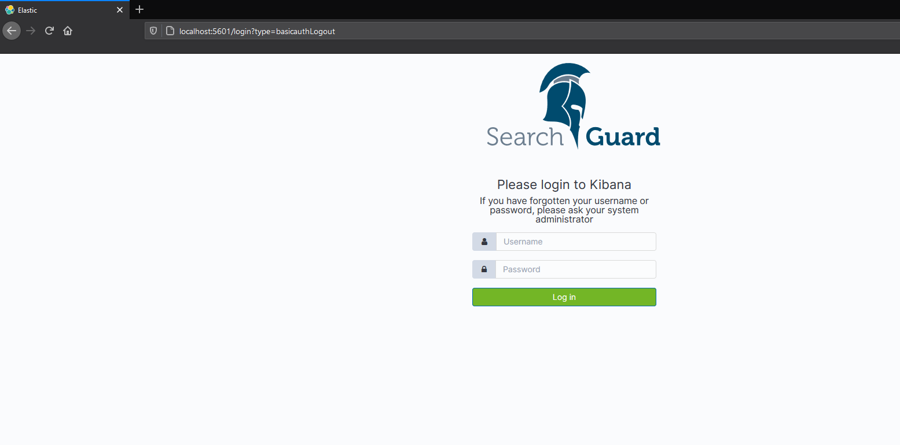
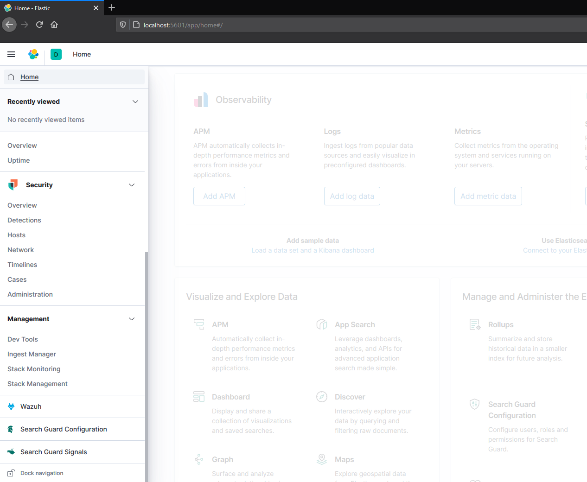
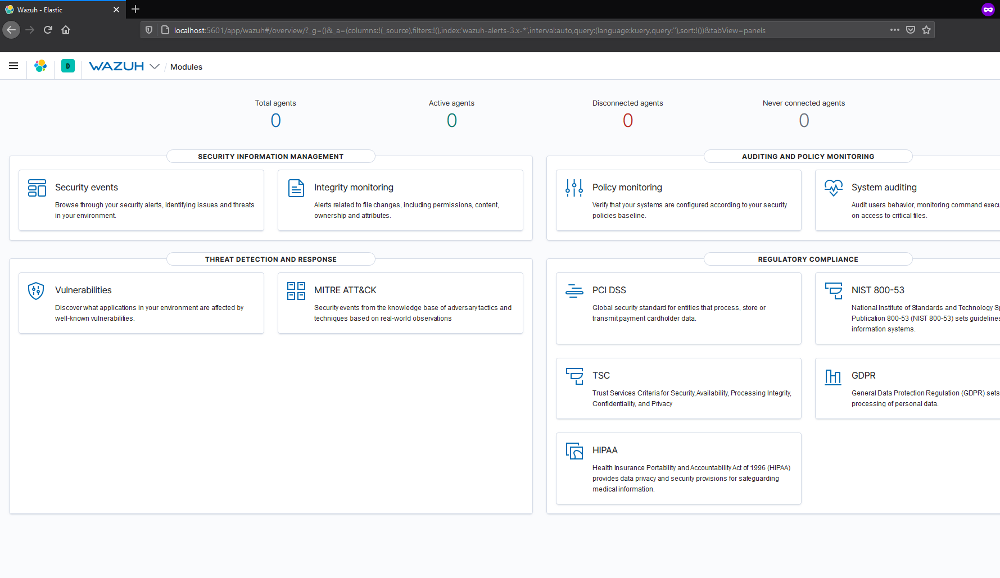
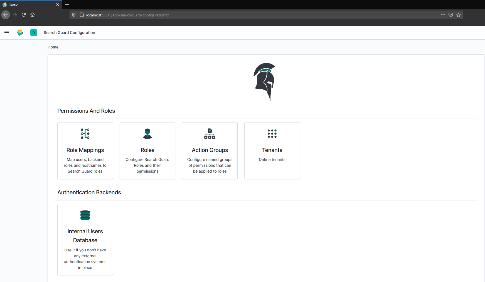
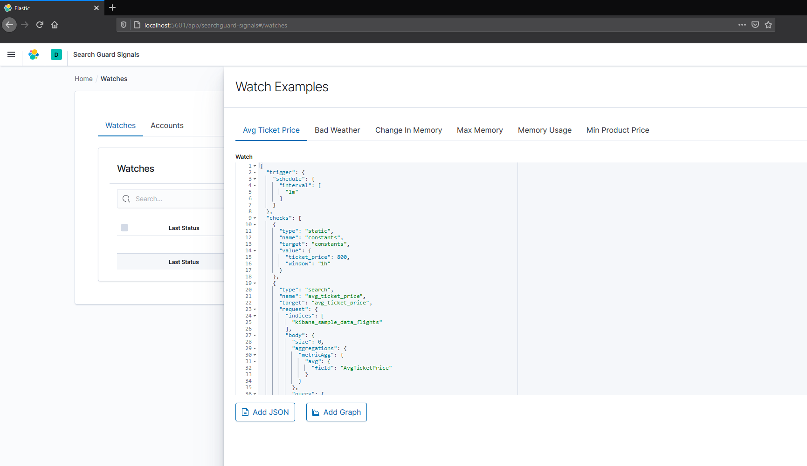

# wazuh-elk-searchguard : 
Wazuh and ELK stack secured with SearchGuard 

In this repository (fork from [wazuh-docker 3.13](https://github.com/wazuh/wazuh-docker/tree/3.13) ) you will find :

* Wazuh: It runs the Wazuh manager, Wazuh API and Filebeat (for integration with Elastic Stack).
* Kibana: Provides a web user interface to browse through alerts data. It includes Wazuh plugin for Kibana, that allows you to visualize agents configuration, and SearchGuard Kibana plugin that ensures the security of the stack and a GUI to configure alerts and SearchGuard Tenants, configure and create Alerts using Signals.
* Elasticsearch: An Elasticsearch container (working as a single-node cluster) using Elastic Stack Docker images.

# Credits : 
These Docker containers are based on:

*  "deviantony" dockerfiles which can be found at [https://github.com/deviantony/docker-elk/tree/searchguard](https://github.com/deviantony/docker-elk/tree/searchguard)
*  "Wazuh-docker" dockerfiles, which can be found at [wazuh-docker 3.13](https://github.com/wazuh/wazuh-docker/tree/3.13)

# Usage : 

To make sure the elasticsearch will run normally, make sure to increase the `vm.max_map_count`on the host machine, as it's detailed in the [Wazuh documentation](https://documentation.wazuh.com/current/docker/wazuh-container.html#increase-max-map-count-on-your-host-linux).

1. `docker-compose up`
2. Once elasticsearch is up, initialize SearchGuard by running: `docker-compose exec -T elasticsearch bin/sg_admin/init_sg.sh` (uses the demo configuration and certificates)
3. You can use the demo users in the SearchGuard demo `admin:admin` to access kibana.

# Photos : 

 
 
 
 

